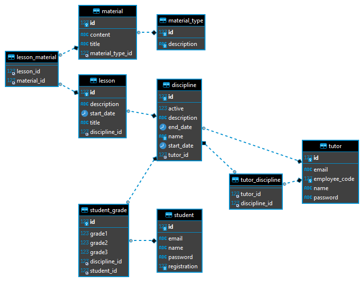
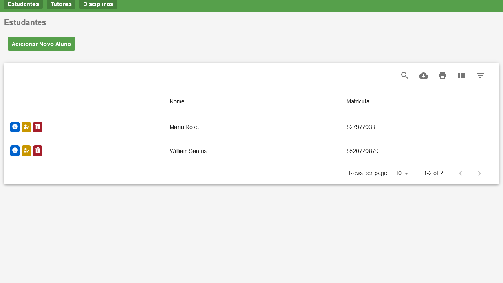
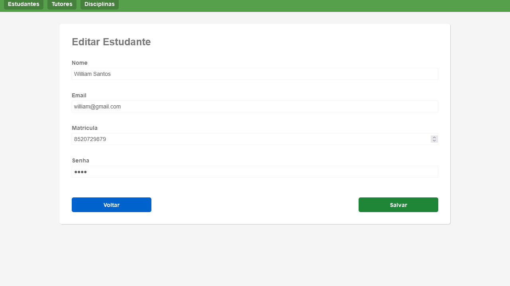

<p align="center">
  App genérico de uma escola virtual<br>
</p>

## Tecnologias
```
- [x] Spring Boot
- [x] MySQL
- [x] Lombok
```
```
- [x] ReactJS
- [x] MUI Datatables
- [x] Axios
- [x] Styled Components
```
## Schema Banco de Dados

<p align="center">
  
</p>

## Imagens
<p align="center">
  
</p>
<p align="center">
  
</p>

